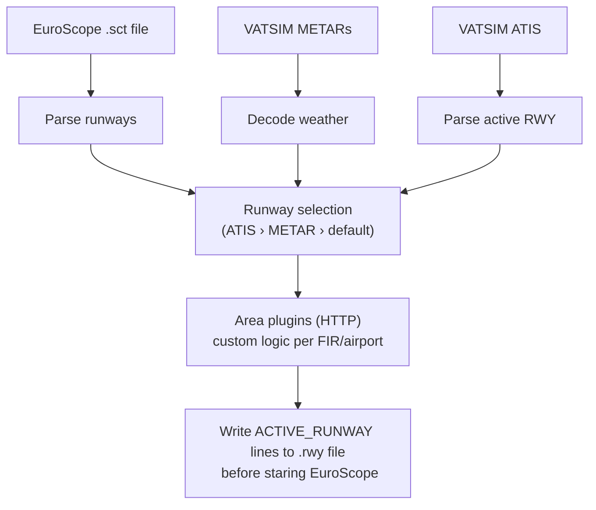

# ENOR Runway Selector

[](https://results.pre-commit.ci/latest/github/meltinglava/ENOR_Vatsim_Runway_Selector/main)

Automatically selects active runways for [EuroScope](https://www.euroscope.hu/) using live METAR data and VATSIM ATIS broadcasts. Designed for VATSIM virtual ATC — **not for real-world operations**.

Based on earlier work by [Adrian2k](https://github.com/Adrian2k/ENOR-autorwy).

---

## How it works



Runway sources are applied in priority order: **ATIS** > **METAR wind** > **fallbacks**.

---

## Quick start

1. Download the latest release for your platform from the [releases page](https://github.com/meltinglava/ENOR_Vatsim_Runway_Selector/releases).
2. Run `es_runway_selector` once — it creates the config directory at `%APPDATA%\meltinglava\es_runway_selector\` (Windows) or the equivalent platform path, and automatically detects your EuroScope sector files.
3. Copy [es_runway_selector/app_launchers.toml](es_runway_selector/app_launchers.toml) into the `config/` subdirectory and edit it to point at your EuroScope `.prf` files.
4. Run `es_runway_selector` again — it will open EuroScope and begin selecting runways.

---

## Configuration

All config files live in the application config directory (printed on first run).

### Automatic setup

On first run the selector scans your EuroScope data folder and creates a config folder for every sector-file area it finds. For example, if your EuroScope folder contains `ENOR-Norway_20250101.sct` and `ESOS-Sweden_20250101.sct`, it will automatically create:

```
config/
  ENOR/
    area.toml
  ESOS/
    area.toml
```

In most cases you don't need to do anything else — the sector file location is found automatically.

### Adjusting area settings (optional)

Open `config/<AREA>/area.toml` to customise behaviour for that area. The main things you might want to set are:

- `ignore_airports` — ICAO codes the selector should skip entirely
- `default_runways` — fallback runway to use when neither ATIS nor METAR wind gives a clear answer
- `plugins` — area plugins to activate (see *Plugins* below)

```toml
# config/ENOR/area.toml

ignore_airports = ["ENNA"]

[default_runways]
ENZV = 18
```

### Multiple controller positions (optional)

If you connect to the same area from more than one EuroScope position — for example Tower and Approach — create `config/<AREA>/profiles.toml` to give each position its own name:

```toml
# config/ENOR/profiles.toml

[[profiles]]
name = "TWR"

[[profiles]]
name = "APP"
```

Both positions share the same sector file. A profile can override any setting from `area.toml` (ignored airports, default runways, plugins). The profile name becomes `ENOR/TWR` or `ENOR/APP` — pass it on the command line to select one:

```
es_runway_selector --profile ENOR/TWR
```

With only one profile configured, running without `--profile` selects it automatically. `--profile ENOR` also works and auto-selects when there is only one `ENOR/*` profile.

For multiple areas in the same installation, each area gets its own folder:

```
config/
  ENOR/
    area.toml
    profiles.toml   (optional)
  ESOS/
    area.toml
```

### Plugins (`config/plugins.toml`)

Each entry defines an external HTTP plugin that handles runway selection for specific airports:

```toml
[[plugins]]
name    = "enor"
command = "es_runway_selector_area_enor"

# Optional: use mise to manage the runtime (Python, Node.js, etc.)
[[plugins]]
name        = "egtt-py"
command     = "python main.py"
runtime     = "python@3.12"       # passed to `mise exec`
working_dir = "C:/plugins/egtt"
```

The parent passes two environment variables to every plugin:
- `ES_RUNWAY_SELECTOR_PLUGIN_PORT` — the TCP port the plugin must listen on
- `ES_RUNWAY_SELECTOR_PORT` — the parent's own helper API port

### Area config downloads (`config/areas.toml`)

Area configs bundle the sector file, plugin binary, and default settings for a FIR:

```toml
# From a dedicated GitHub repo (looks for a release asset matching *.tar.gz or *.zip)
[[areas]]
name   = "enor"
source = { type = "github", repo = "meltinglava/ENOR_Vatsim_Runway_Selector" }

# From a central manifest listing multiple areas
[[areas]]
name   = "egtt"
source = { type = "manifest", url = "https://example.com/areas.json", key = "egtt" }
```

```
es_runway_selector --list-areas          # show available areas
es_runway_selector --download-area enor  # download and install
```

---

## CLI reference

```
es_runway_selector [OPTIONS]

Options:
  -p, --profile <NAME>         Use a specific profile from profiles.toml
      --download-area <AREA>   Download and install an area config package
      --list-areas             List available areas from areas.toml sources
      --clean-config           Re-initialise config directory
  -h, --help                   Print help
```

---

## Writing your own plugin

If no area plugin exists for your FIR, you can write one in any language that
can serve HTTP. See [PLUGIN_DEVELOPMENT.md](PLUGIN_DEVELOPMENT.md) for the
protocol, ready-to-use TypeScript/Python skeletons, and the reference Rust
implementation.

---

## Building from source

```sh
# Format
cargo fmt --all

# Lint
cargo clippy -- -D warnings

# Test
cargo test --all-features --locked

# Release binary
cargo build --release --locked --bin es_runway_selector
```

CI targets `x86_64-unknown-linux-musl` for checks and produces release artifacts for Windows (MSVC) and Linux (musl).

---

## App launcher

The application can open EuroScope (and other programs) at startup.

1. Open `%APPDATA%\meltinglava\es_runway_selector\config\` (run the app once to create it).
2. Copy [es_runway_selector/app_launchers.toml](es_runway_selector/app_launchers.toml) into that folder.
3. Edit the file to match your EuroScope `.prf` files and how many instances you want.

---

## Issues

Report bugs on the [GitHub issue board](https://github.com/meltinglava/ENOR_Vatsim_Runway_Selector/issues).

---

#### License

Licensed under either of [Apache License, Version 2.0](LICENSE-APACHE) or [MIT license](LICENSE-MIT) at your option.

Unless you explicitly state otherwise, any contribution intentionally submitted for inclusion in this work by you shall be dual licensed as above, without any additional terms or conditions.
